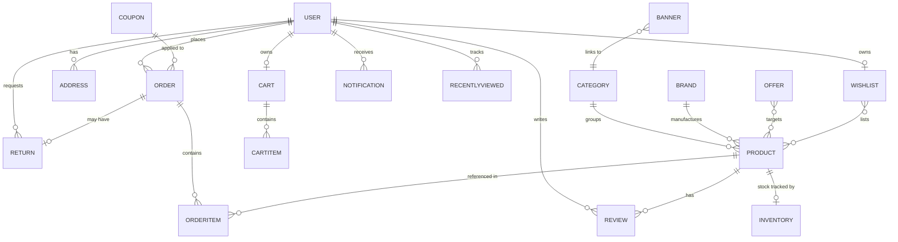

# Database ER Diagram

MongoDB (document) model. Relationships are expressed via `ObjectId` references. The diagram below
uses Mermaid; it renders on GitHub and in most Markdown viewers.

## Collections

| Collection       | Purpose                                                       |
| ---------------- | ------------------------------------------------------------- |
| `users`          | Accounts, roles, saved cards (tokenized), auth material.      |
| `products`       | Catalog items with full eyewear attributes and flags.         |
| `categories`     | Product categories (eyeglasses, sunglasses, computer, kids…). |
| `brands`         | Brands / house labels.                                        |
| `orders`         | Orders with embedded order items and status timeline.         |
| `reviews`        | Ratings, text, images, likes; moderated.                      |
| `coupons`        | Discount codes and rules.                                     |
| `offers`         | Automatic offer engine rules / seasonal collections.          |
| `addresses`      | User shipping/billing addresses.                              |
| `carts`          | Per-user cart with embedded items.                            |
| `wishlists`      | Per-user wishlist product references.                         |
| `notifications`  | Per-user notifications.                                       |
| `banners`        | Home/marketing banners managed by admin.                      |
| `returns`        | Return/exchange requests + refund status.                     |
| `inventory`      | Stock ledger + low-stock thresholds.                          |
| `recentlyviewed` | Per-user recently viewed products.                            |
| `settings`       | Global store settings.                                        |

> Field-level schemas are documented alongside the Mongoose models in Phase 3.
